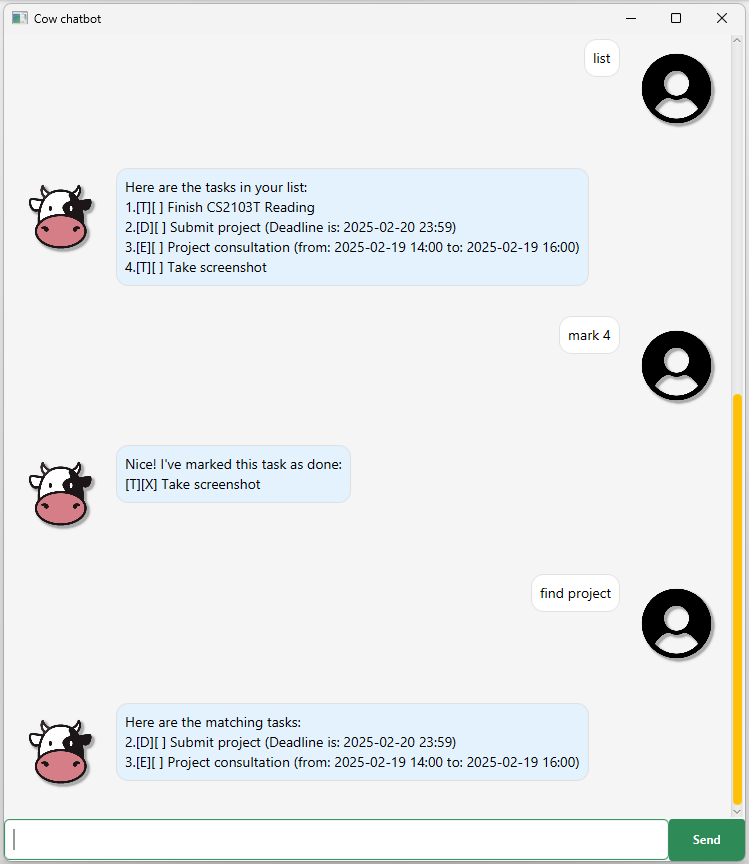

# Cow User Guide
Cow is a simple and CLI task manager designed to help users track their tasks seamlessly.
You can easily add, find, complete, and remove tasks.
Below are the core features and their usage examples.



## To exit the Program
Exits the program.

Usage: `bye` or `exit` or `close`

## List All Tasks
Displays all tasks currently in the task list.

Usage: `list`

```
Example: List

Output:
Here are the tasks in your list:  
1.[T][ ] Finish CS2103T Reading  
2.[D][X] Submit project (deadline is: 2025-02-20 23:59)  
3.[E][ ] Project consultation (from: 2025-02-19 14:00 to: 2025-02-19 16:00)  
```

## Find Tasks
Searches for tasks that match the given keyword.

Usage: `find <keyword>`

```
Example: find project

Output:
Here are the matching tasks in your list:  
2.[D][X] Submit project (deadline is: 2025-02-20 23:59)  
3.[E][ ] Project consultation (from: 2025-02-19 14:00 to: 2025-02-19 16:00)  
```

## Delete Task
Removes a task from the task list by its index.

Usage: `delete <number>`

```
Example: delete 1

Output:
Noted. I've removed this task:  
[T][ ] Finish CS2103T Reading  
Now you have 2 tasks in the list.  
```

## Mark or Unmark a Task
Marks a task as done or undone

Usage: `mark <number>` or `unmark <number>`

```
Example: mark 2

Output:
Nice! I've marked this task as done:  
[D][X] Submit project (deadline is: 2025-02-20 23:59)  
```
```
Example: unmark 2

Output:
OK, I've marked this task as not done yet:  
[D][ ] Submit project (deadline is: 2025-02-20 23:59)  
```
## Add a Todo Task
Adds a task with a description.

Usage: `todo <task description>`

```
Example: todo Finish CS2103T Reading

Output:
Got it. I've added this task:  
1.[T][ ] Finish CS2103T Reading  
Now you have 1 tasks in the list.  
```
## Add a Deadline Task
Adds a task with a description and deadline.

Usage: `deadline <task description> /by <deadline>`

```
Example: deadline Submit project /by 2025-02-20 2359

Output:
Got it. I've added this task:  
[D][X] Submit project (deadline is: 2025-02-20 23:59)   
Now you have 2 tasks in the list.
```
## Add a Event Task
Adds a task with a description, start date, and end date.

Usage: `todo <task description> /from <start date> /to <end date>`

```
Example: event Project consultation /from 2025-02-19 14:00 /to 2025-02-19 16:00

Output:
Got it. I've added this task:  
[E][ ] Project consultation (from: 2025-02-19 14:00 to: 2025-02-19 16:00)  
Now you have 3 tasks in the list.  
```
